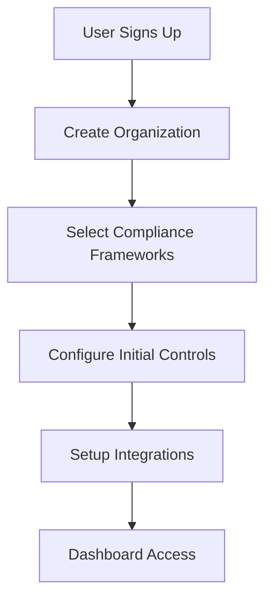
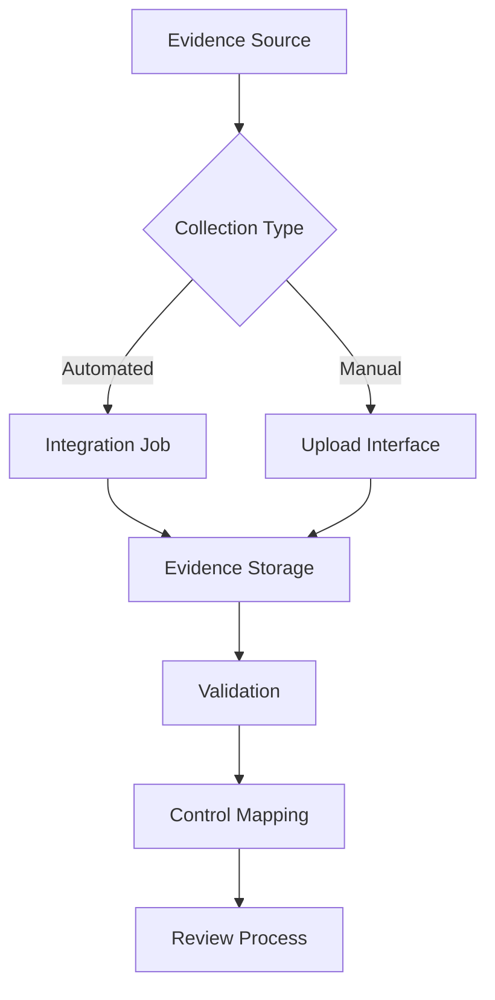
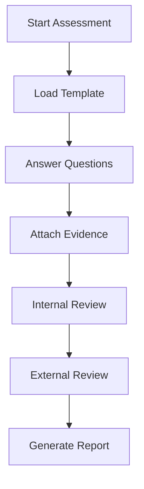
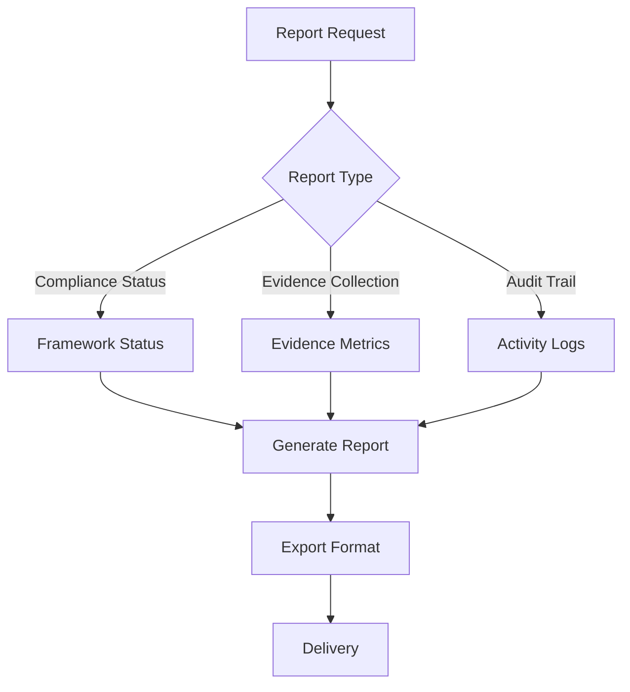
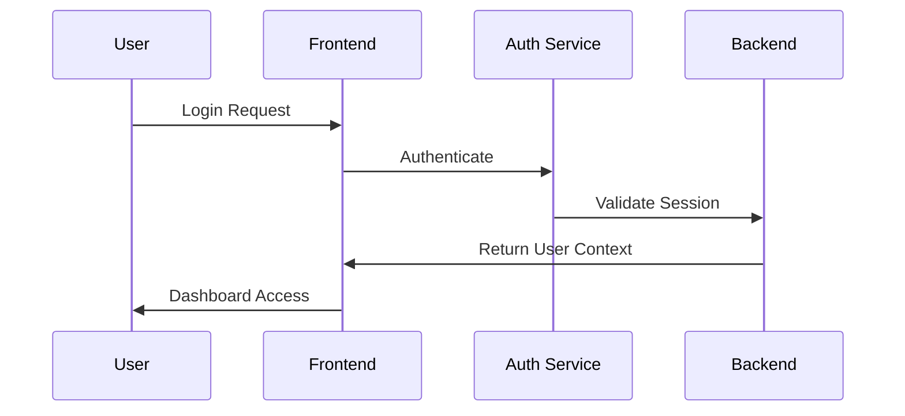
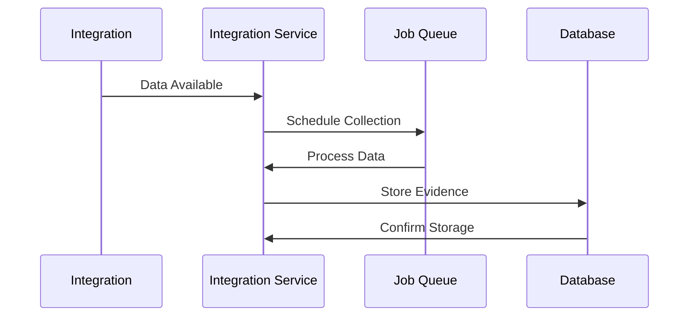
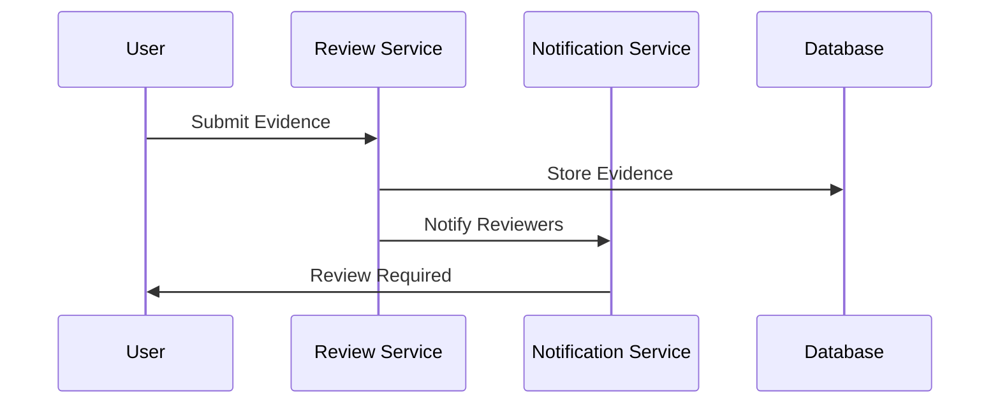
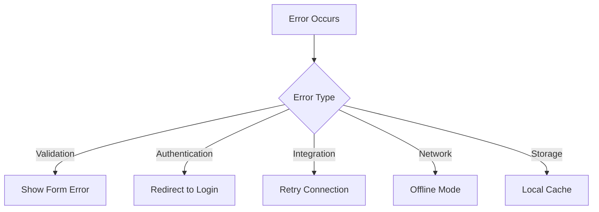

# Compliance OS - Application Flow Documentation

## User Journeys

### 1. Initial Setup Flow



#### Details
1. User Registration
   - Email/password signup
   - SSO authentication option
   - Organization creation
   - Role assignment

2. Framework Selection
   - Choose primary framework
   - Add additional frameworks
   - Map overlapping controls
   - Set compliance goals

3. Integration Setup
   - Connect cloud services
   - Setup communication tools
   - Configure monitoring systems
   - Test connections

### 2. Evidence Collection Flow



#### Automated Collection
1. Integration Trigger
   - Scheduled jobs
   - Event-based collection
   - Real-time monitoring

2. Processing
   - Data validation
   - Format conversion
   - Metadata extraction
   - Control mapping

3. Storage
   - Secure file storage
   - Database records
   - Version control
   - Audit logging

#### Manual Upload
1. User Interface
   - File upload
   - Metadata input
   - Control selection
   - Description entry

2. Processing
   - File validation
   - Virus scanning
   - Format verification
   - Size limitations

### 3. Compliance Assessment Flow



#### Assessment Steps
1. Template Selection
   - Framework-specific templates
   - Custom questionnaires
   - Previous assessment import

2. Response Collection
   - Question answering
   - Evidence attachment
   - Comment threads
   - Progress tracking

3. Review Process
   - Internal validation
   - External auditor review
   - Gap analysis
   - Remediation planning

### 4. Reporting Flow



#### Report Generation
1. Data Collection
   - Status aggregation
   - Metric calculation
   - Log compilation
   - Evidence summary

2. Format Processing
   - PDF generation
   - CSV export
   - Excel workbooks
   - Custom formats

3. Distribution
   - Email delivery
   - Secure download
   - API access
   - Scheduled delivery

## System Interactions

### 1. Authentication Flow



### 2. Integration Flow



### 3. Evidence Review Flow



## State Management

### 1. Global State
```typescript
interface GlobalState {
  user: {
    id: string;
    organization: string;
    role: UserRole;
    permissions: Permission[];
  };
  settings: {
    theme: 'light' | 'dark';
    notifications: NotificationSettings;
    defaultFramework: ComplianceFramework;
  };
  integrations: {
    connected: Integration[];
    status: Record<string, IntegrationStatus>;
  };
}
```

### 2. Component State
```typescript
interface DashboardState {
  activeView: 'overview' | 'compliance' | 'evidence' | 'reports';
  filters: {
    framework: ComplianceFramework;
    dateRange: DateRange;
    status: Status[];
  };
  loading: boolean;
  error: Error | null;
}
```

## Error Handling

### 1. Error Types
```typescript
type ErrorType =
  | 'ValidationError'
  | 'AuthenticationError'
  | 'IntegrationError'
  | 'NetworkError'
  | 'StorageError';

interface AppError {
  type: ErrorType;
  message: string;
  code: string;
  details?: Record<string, any>;
  retry?: boolean;
}
```

### 2. Error Flow


## Performance Optimization

### 1. Loading States
```typescript
interface LoadingState {
  initial: boolean;
  content: boolean;
  action: boolean;
  background: boolean;
}
```

### 2. Caching Strategy
```typescript
interface CacheConfig {
  type: 'memory' | 'localStorage' | 'indexedDB';
  ttl: number;
  maxSize: number;
  priority: 'speed' | 'space';
}
```

## Security Measures

### 1. Data Protection
```typescript
interface SecurityConfig {
  encryption: {
    algorithm: string;
    keySize: number;
    mode: string;
  };
  storage: {
    type: 'encrypted' | 'plain';
    location: 'local' | 'remote';
  };
  transmission: {
    protocol: 'https' | 'wss';
    encryption: boolean;
  };
}
```

### 2. Access Control
```typescript
interface AccessControl {
  role: UserRole;
  permissions: Permission[];
  restrictions: Restriction[];
  expiry: number;
  mfa: boolean;
}
```